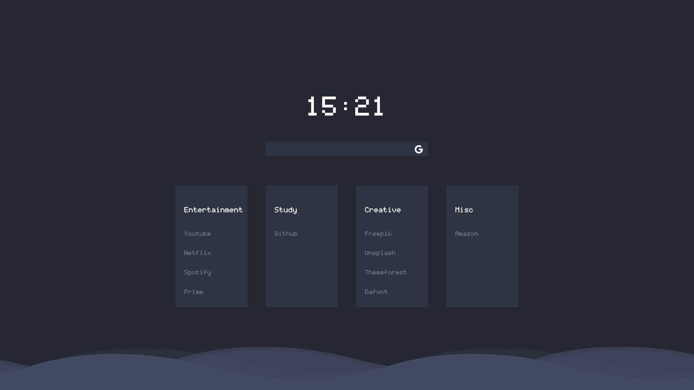

# Wave

Original source: https://github.com/Tobias-Schoch/startpage-wave

Found via a Reddit post: https://www.reddit.com/r/startpages/comments/ggcfit/with_source_if_you_want_3/

## Features

### Folder and links

You can define the folders and the links in each folder in the start menu.
